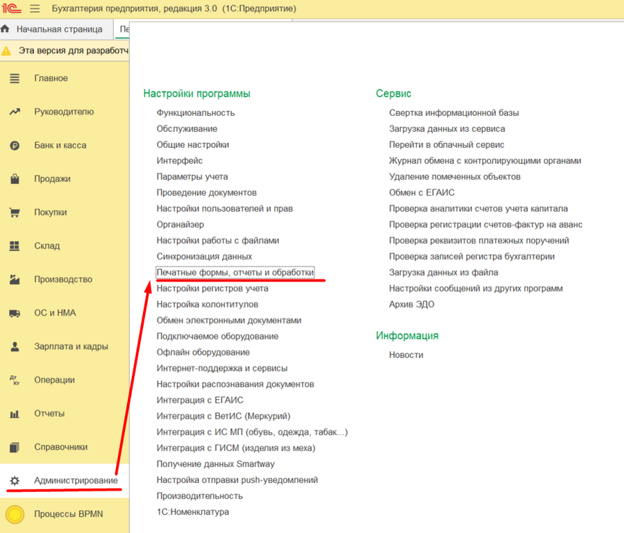
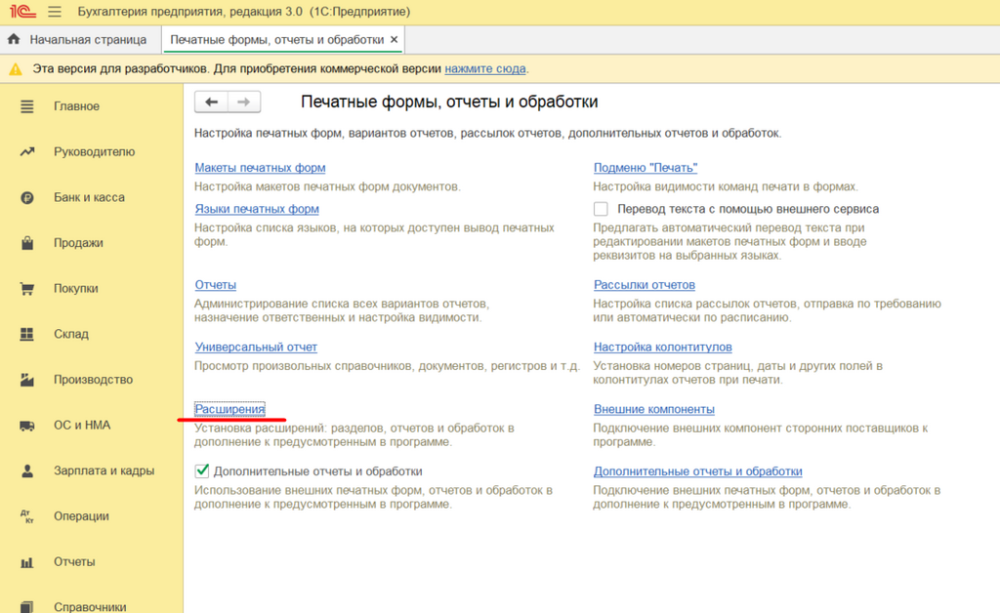
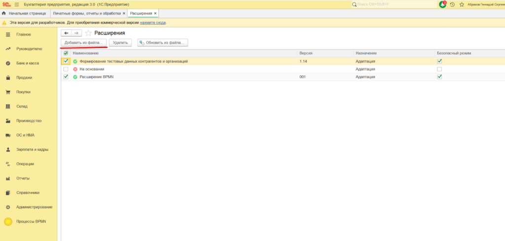
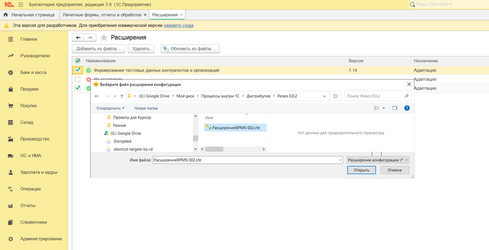

# Установка расширения «Схемопоинт» в 1С

## Перед установкой

1. Перед установкой используйте копию информационной базы.
2. У пользователя должны быть права администратора и права на открытие дополнительных отчётов и обработок.
3. После установки снимите признак «Защищённый режим».

## Шаг 1

## Шаг 2

## Шаг 3

## Шаг 4

Выберите загруженный файл и подключите его как расширение.

